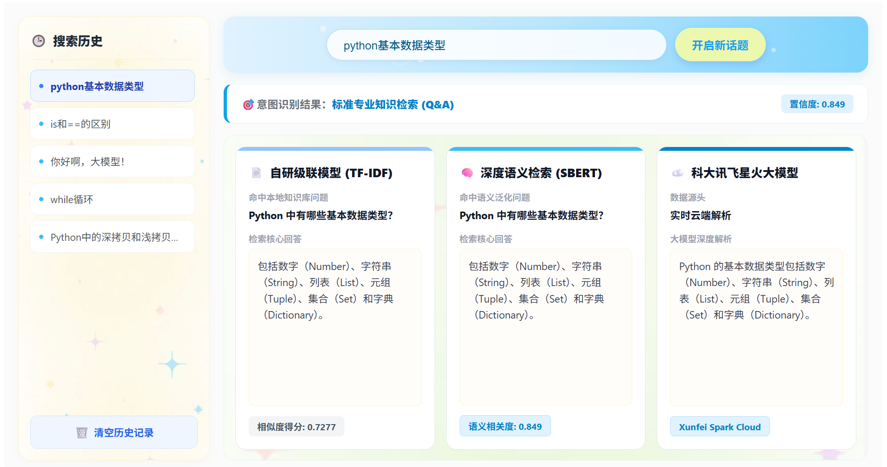

# 面向教育领域的 Python 智能文档问答与算法对比系统

这是一个专门面向教育领域设计的 Python 知识智能问答系统。项目采用**前后端分离架构**，核心亮点在于构建了**“双本地算法引擎分流拦截”**机制，并引入了**全网云端大模型同台竞技的质量对比网关**，完美实现了传统检索算法、深度语义检索模型与大厂商业 LLM 的同台对决与全方位可视化评测。

## 系统界面展示



---

## 系统核心架构与技术栈

本系统从底层的数据清洗、意图识别，到高维向量匹配以及前端高对比度可视化，均实现了全链路的工程化打通：

* **前端展示层 (Frontend):** 基于 **Vue 3 (Script Setup)** 响应式框架构建。采用 Vite 构建工具，打造现代化、高可读性的数据对决三栏栅格大屏。
* **后端网关层 (Backend):** 采用 **FastAPI** 高性能异步 Web 框架，打通前置意图分类网关，提供高速的端到端 API 响应。
* **字面检索引擎:** 基于 **Jieba** 中文分词与 **Scikit-Learn (TF-IDF)** 构建词频矩阵，优化停用词表与单字 Token 匹配模式，实现零延迟的字面精准召回。
* **深度语义引擎:** 挂载 **Sentence-Transformers** 框架，利用本地神经网络模型 `shibing624/text2vec-base-chinese`，将知识库问题映射至高维语义向量空间，通过余弦相似度捕捉长尾泛化意图。
* **云端对比引擎:** 挂载远端 **科大讯飞星火大模型 (Xunfei Spark Cloud API)**，作为基准参照物，同台输出深度解析。

---

## 系统核心机制与业务链路

### 1. 前置双重意图拦截网关
为了防止日常闲聊、不满意情绪或领域外 (OOD) 无关提问无端消耗服务器算力，后端构建了多级拦截机制：
* **Rule-based 意图拦截:** 精准提取寒暄打招呼 (`Chitchat`) 及否定词汇 (`Negation`)。
* **OOD (领域外) 语义拦截:** 当 Sentence-BERT 计算的最高语义相似度低于设定阈值 (`0.45`) 时，网关自动判定为非 Python 领域问题，触发拦截。

### 2. 状态驱动的智能 UI 渲染
系统智能化处理各种提问状态，并维持整齐划一的三栏对比结构：
* **精准匹配成功:** 当检索得分超越置信度阈值，卡片上方动态亮起 **绿色 ✨ 精准匹配成功** 标签。
* **推荐相似问题:** 当得分未达标时，系统不会拒绝回答，而是自动抹除文本硬编码前缀，在上方优雅升起 **黄色 💡 推荐最相似问题** 标签，实现柔性引导。
* **全链路答案加框优化:** 针对本地检索答案引入内凹质感的浅蓝灰圆角框，与大模型卡片形成完美的视觉呼应与图形化分层。

---

## 项目真实目录结构

```text
python_qa_system/                  # 项目大总管根目录
│
├── python_qa_frontend/            # 前端工程根目录
│   └── python_qa_frontend/        
│       └── qa-ui/                 # 核心 Vue 3 前端项目
│           ├── src/               # 界面源代码目录 (App.vue 等)
│           ├── public/            # 静态资源
│           ├── index.html         # 单页面入口
│           ├── package.json       # 前端依赖配置文件
│           └── vite.config.js     # Vite 构建配置文件
│
└── python_qa/                     # 后端算法核心目录
    ├── main.py                    # 后端核心网关、路由与分流逻辑
    ├── intent_classifier.py       # 前置意图分类器 (Chitchat/Negation/Query)
    ├── search_engine.py           # TF-IDF 字面检索引擎
    ├── sbert_engine.py            # Sentence-BERT 深度语义向量引擎
    ├── xf_api.py                  # 科大讯飞远端云大模型调用接口
    ├── make_data.py               # 知识库数据构建/初始化脚本
    └── faq_dataset.json           # 本地 100 条核心 Python 问答知识库
    
```

## 本地快速开始
1. 后端服务启动
进入 python_qa 目录，确保本地 Python 环境为 3.12+，并配置好显卡环境：
```Bash
cd python_qa

# 启动 FastAPI 后端核心网关
uvicorn main:app --reload --host 127.0.0.1 --port 8000
```
2. 前端服务启动
进入 qa-ui 核心目录，安装依赖并开启本地开发服务器：
```Bash
cd python_qa_frontend/python_qa_frontend/qa-ui
npm install
npm run dev
```
打开浏览器访问终端输出的本地地址（通常为 http://localhost:5173）即可开启算法对决